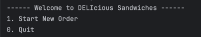

DELIcious Sandwiches Ordering System
--
___
Overview
-
The DELIcious Sandwiches Ordering System is a Java application that allows a user to place orders for sandwiches, drinks, and chips. The user can customize their sandwiches by choosing the size, type of bread, toppings, and whether they want it toasted. The application also supports signature sandwiches for quick ordering.

---
Features
--
**Main Menu**

**Starting a new Order**

**Adding a Signature Sandwich**

**Adding Chips**

**Adding a Drink**

**Checking Out**

**Adding a Custom Sandwich**

---
Interesting Code
--

Inside the Order class the 'saveReceipt()' and 'generateFileName()' work in tandem to save the Order to a file. The 'generateFileName()' dynamically generates a unique file name based on the current date and time, while the 'saveReceipt()' method writes the order details to the file with formatted prices, and handles any potential IOExceptions. I found thus interesting because it demonstrates how to handle creation of new files in Java. 

